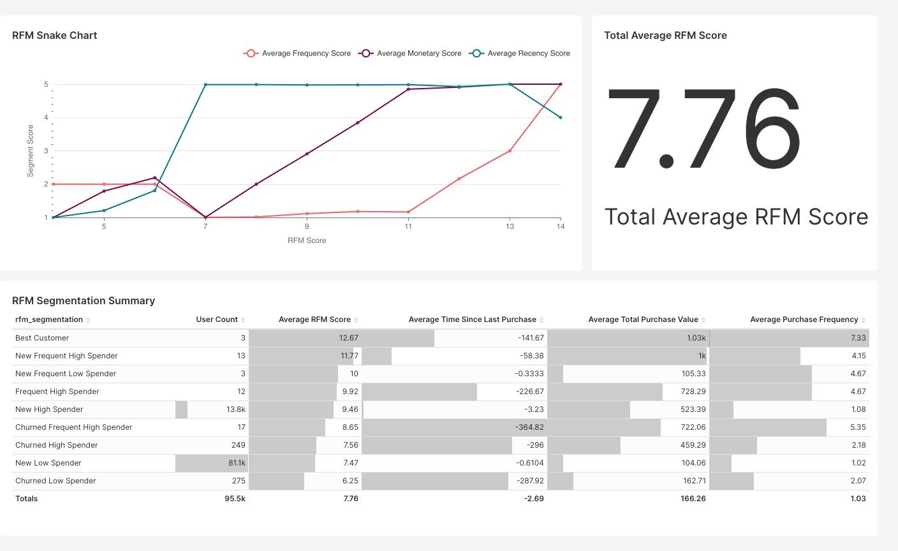

## Pre-requisites

- Docker https://docs.docker.com/engine/install/

## How to run the project

1. run `airflow_up.sh`
2. **wait** until all docker containers are up and running
3. run `add_airflow_connection.sh` to add postgres connection to airflow
4. check docker container health by executing `docker ps`
5. If `airflow-webserver` is still unhealthy, **wait** and repeat from step 4 
    - the wait time is usually around 7-15 minutes
6. visit `localhost:8080` (the username and password are `admin` and `admin` respectively) to open Airflow Webserver UI
7. turn-on `raw_to_clean_daily_12.00_PM` and `raw_to_clean_weekly_sunday_12.00_PM` DAGs
    - If you get an error, the most likely cause is the database and schema is not defined properly. If airflow logs confirms that assumption, you can execute `seed_postgres_ecommerce.sh` and clear tasks (this should fix the issue)
8. **wait** until `raw_to_clean_daily_12.00_PM` DAG has ran successfully 791 times (this will take some time)
9. trigger `marketing_RFM_views` DAG manually
10. run `airflow_down.sh` to stop airflow containers.
11. run `superset_up.sh` to turn on Apache Superset container.
11. visit `localhost:8088` (the username and password are `admin` and `admin` respectively) to open Apache Superset.
12. `[Marketing] Recency, Frequency, Monetary Dashboard` dashboard should be available in `Dashboards` tab. 
13. run `down.sh` when you're done.
